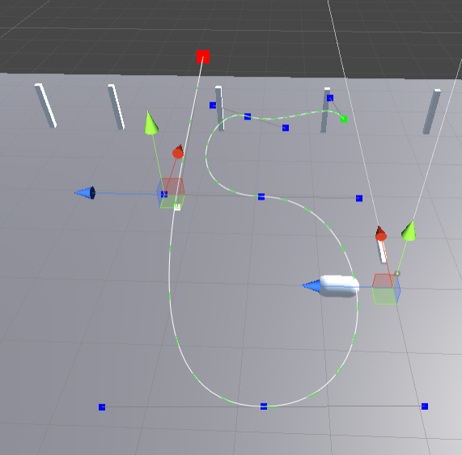
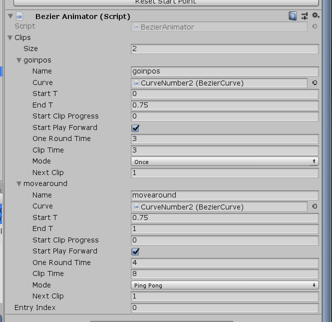
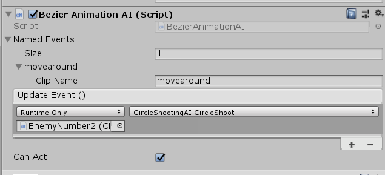
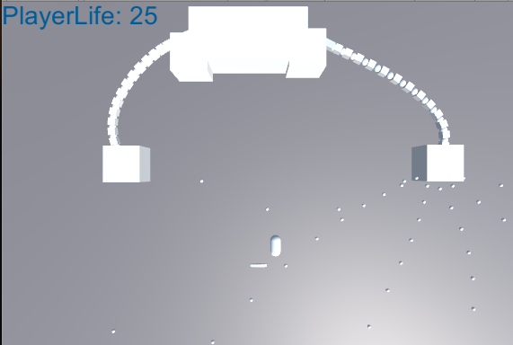

# CraftDemo

这是一个用Unity写的打飞机游戏，游戏内容还不够丰富，目前只开发了关键的一些组件，比如飞机的动画控制方式。
所有飞机的移动通过自定义的Bezier曲线来设置：  

  

-----

仿照3D模型的Animator样式，我创建了一个BezierAnimator，用于制作飞机的移动动画，在其中可以定义片段，然后设置片段的播放效果（时长、循环等）以及播放完成之后的下一个片段：  

  
*多个物体可以使用同一个BezierAnimator来达到复用的效果*  

-----

这个曲线动画还可以搭配一个自定义的AI组件，实现角色的AI。
为指定的动画片段名称，设置相关的更新函数。  

游戏的最终Boss综合上述的所有工具，实现触手模型以及动画：

